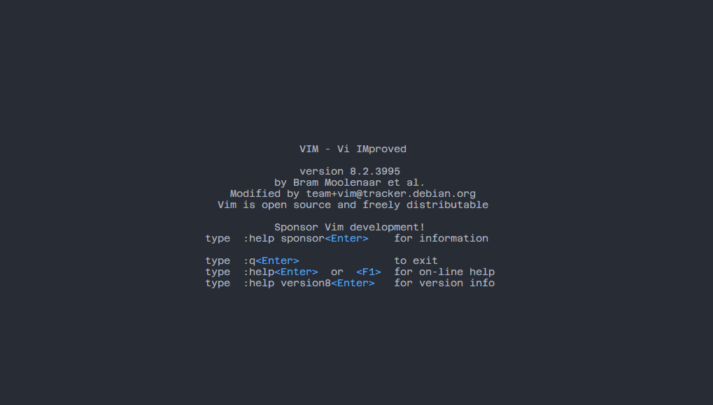
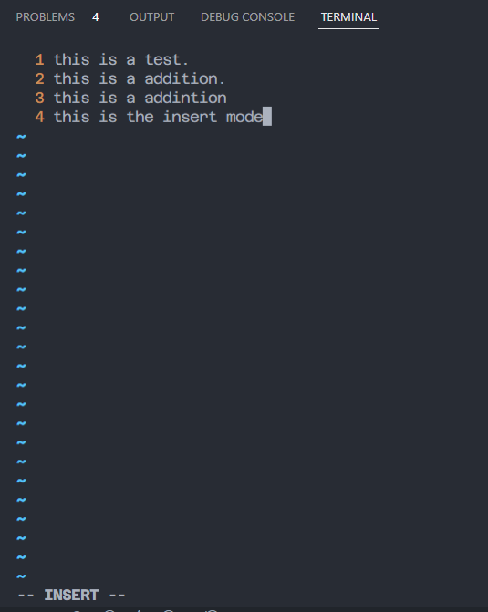
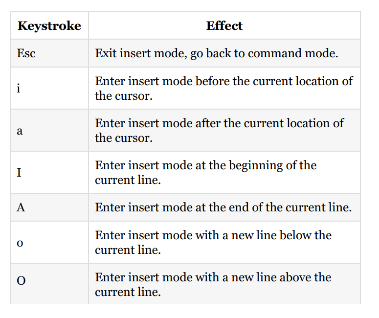
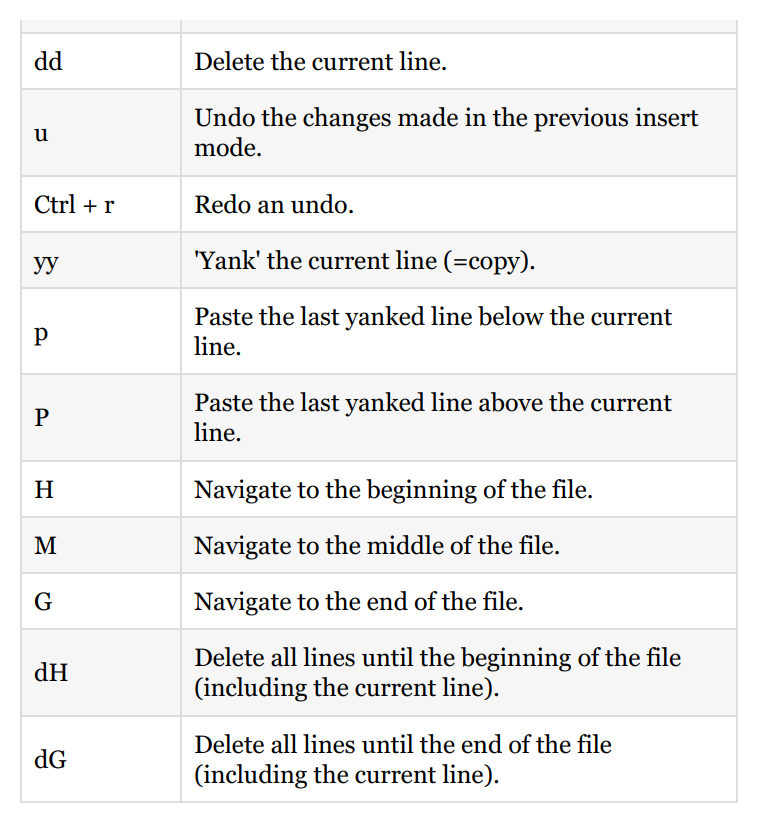
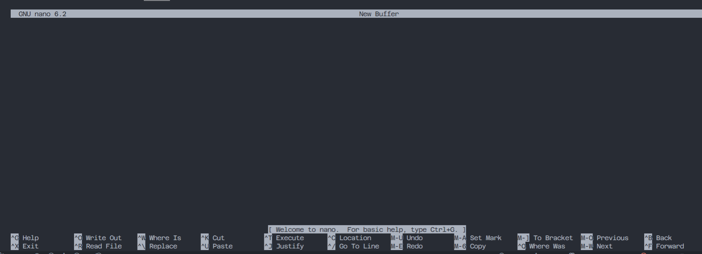
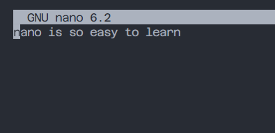
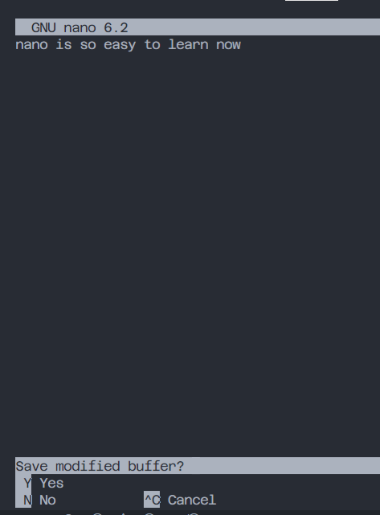

- [Technical requirements](#technical-requirements)
- [Using graphical editors for shell scripting](#using-graphical-editors-for-shell-scripting)
  - [Atom](#atom)
    - [Atom installation and configuration](#atom-installation-and-configuration)
  - [Notepad++](#notepad)
- [Using command-line editors](#using-command-line-editors)
  - [Vim](#vim)
    - [Vim summary](#vim-summary)
    - [.vimrc](#vimrc)
    - [Vim cheat sheet](#vim-cheat-sheet)
  - [nano](#nano)
- [Combining graphical editors with command-line editors when writing shell scripts](#combining-graphical-editors-with-command-line-editors-when-writing-shell-scripts)
- [Questions](#questions)
- [Further reading](#further-reading)

### Technical requirements
You will need the virtual machine we created in the previous
chapter when using Vim or nano. If you want to use Notepad++,
you will need a Windows host machine. For Atom, the host
machine can run either Linux, macOS, or Windows.

### Using graphical editors for shell scripting
Tooling has come a long way since the first Unix and Unix-like
distributions. In the earliest days, writing shell scripts was
significantly harder than today: the shells were less powerful,
text editors were command-line only and things such as syntax
highlighting and autocomplete were non-existent. Today, we
have very powerful GUI editors that will help us in our scripting
adventures. Why would we want to wait until we run a script to
find an error, when a GUI editor could have already shown us
the error in advance? Today, using an advanced editor for shell
scripting is almost a necessity that we wouldn't want to live
without.

We'll describe two text editors in the coming pages: Atom and
Notepad++. Both are GUI-based, which we can use for efficient
shell scripting. If you have a preference for either already, pick
that one. If you're unsure, we would recommend using Atom.

#### Atom
The first graphical editor we will consider is Atom, made by
GitHub. It's described as A hackable text editor for the 21st
Century. Hackable, in this sense, means that while the default
installation of Atom is as complete as any text editor, this
application really shines because it is very configurable and
extensible. Anything that has not been integrated by GitHub can
be written as an extension package. By using these extensions,
you can make your Atom installation fully your own; if you do
not like something, change it. If it can't be changed out of the
box, find a package that does it. And even if there's not a package
that does what you're hoping, you still have the option to create
your own package!

Another nice feature of Atom is the default integration with Git
and GitHub. Git is currently the most popular version control
system. Version control systems are used when writing code or
scripts. They ensure that history of files is preserved, and make it
possible for multiple, even many, contributors to work on the
same files at the same time, without getting burdened down by
conflict management. GitHub, as the name suggests, is currently
the most prominent web-based Git provider for open source
software.

The last great thing about Atom we want to mention is that, by
default, it supports many scripting and programming languages.
When we say supports, we mean that it can recognize file types
by their extensions, and offer syntax highlighting (which makes
for much easier scripting!). This functionality is provided
through core packages, which work the same way as normal

packages but are included from the start. For our purposes, the
core package, language-shellscript, will help us in our shell
scripting endeavors.

##### Atom installation and configuration
Let's go ahead and install Atom. As long as you're running Linux,
macOS, or Windows, you can go to https://atom.io/ and grab the
installer. Run the installer and, if necessary, follow along with
the prompts until Atom is installed. Now, start Atom and you'll
be greeted by the welcome screen, which at the time of writing
looks like the following:

Be sure to look at all the screens Atom has to offer. When you
feel like you've explored enough, let's add a package to Atom that
will complement our shell scripting. If you have the Welcome
Guide screen still open, select Install a Package from there.
Otherwise, you can use the keyboard shortcut Ctrl + , to bring up
the Settings screen. You will see an Install option there, which
will take you to the Install Packages screen. Search for bash, and
you should see the following package:

Click the Install button and watch the installation. You might be
prompted to reboot Atom after the install; be sure to do so. If
you're not prompted but see errors of any kind, a reboot of Atom
is never a bad idea. After installing the package, you will now
have autocomplete functionality when writing shell scripts. This
means that you can start typing and Atom will try to predict what
you want, in the following manner:

On the right-hand side, you can see we started typing the
echo shell command, and after the first two letters, Atom
presented us with two options that contain those two letters.
Once it makes a suggestion, we can press Enter and the
command is inserted fully. While it will not save much time in
this instance, it can be great for two main reasons:

- If you're unsure what the command is called exactly, you
might be able to find it with autocomplete.
- Once you start writing conditionals and loops (in the
second part of this book), the autocomplete will span
multiple lines, saving you from typing many words and
remembering all the syntax.

Finally, let's look at how Atom looks when you've got a Git
project open and are working on files:

When working in Atom, the screen will mostly look like this. On
the left-hand side, you'll see the Tree View, which you can
toggle on/off by pressing Ctrl + \. The Tree View contains all the
files in your current project (which is the directory you've
opened). All these files can be opened by double-clicking them,
which causes them to appear in the middle: the Editor View.
This is where you'll spend most of your time, working on the
shell scripts. The Editor View will always be visible, even if there
are currently no files open.

By default, there is one last view, the Git View, located on the
right-hand side. This view can be toggled by pressing
Ctrl +Shift + 9. The code for this book is hosted on GitHub,
which you will download (or, as Git calls it, clone) once, without
the need to edit it on the remote server. Because of this, the Git
View is not needed in this book, but we mention it since you will
probably use it for other projects.

#### Notepad++
Where Atom is closer to an integrated development
environment (IDE) than a text editor, Notepad++ is pretty
much what the name implies: good old Notepad with some
added features. Some of these added features include being able
to have multiple files open at the same time, syntax highlighting,
and limited autocomplete. It was initially released in 2003 and
only works on Windows.

Notepad++ is characterized by its simplicity. If you are familiar
with any kind of Notepad software (who isn't?), Notepad++
should be instantly recognizable. While we recommend using
Atom for this book, using a simple solution such as Notepad++
will definitely not hold you back. However, in a business
environment, you would almost always create scripts in an
already existing version-controlled repository, which is where
the added features of Atom really shine.

If you would like to check out Notepad++, grab it from https://note
pad-plus-plus.org/download and run the installer (remember, only if
you're on Windows!). Keep the default options and run
Notepad++ after the installation. You should be greeted by the
following screen:

As you can see, when you open a file ending in .sh, you will see
syntax highlighting. This is because the .sh extension is reserved
for shell script files. This can help you immensely when writing
scripts. The example of a missing quote messing up your script
will become really apparent with color-based syntax
highlighting, possibly saving you many minutes of
troubleshooting.

Notepad++ has many other features that make it a great
enhanced Notepad. You can use macros to perform scripted
tasks, you can install plugins to extend functionality, and there
are many more unique features that make Notepad++ an
attractive option

### Using command-line editors
Being able to use command-line editors is a skill anyone working
with Linux should learn sooner or later. For Linux installations
with a GUI, this might be substituted with a GUI tool such as
Atom or the distribution's built-in variant on Notepad. However,
server installations will almost never have a GUI and you will
have to rely on command-line text editors. While this might
sound daunting, it's really not! To give you a small introduction
to command-line editors, we'll go over two of the most popular
applications that are present on most Linux distributions: Vim
and GNU nano.

#### Vim
The first command-line text editor we will discuss is perhaps the
most popular for Linux: Vim. Vim is derived from the term Vi
Improved, as it is an updated clone of the Unix editor Vi. It was
created and is still maintained by Bram Moolenaar, who first
released Vim publicly in 1991. Vim (or, on very old systems, Vi)
should be present on all Unix or Unix-like machines you will
encounter.

Vim is considered a hard-to-learn tool. This is mainly caused by
the fact it works very differently from text editors that most
people are used to. However, once the initial learning curve is
over, many agree that a lot of actions can be done in Vim much
more quickly than in a normal text editor (such as Microsoft's
Notepad++).

Let's jump in! Log in to your virtual machine:

```bash
$ ssh chamra@192.168.163.131 -p 22
```
Once logged in, open Vim to an empty file:
```bash
chamara@ubuntu22:~$ vim
```
You should be greeted by something looking approximately like
the following:


Vim starts a new process that uses your entire Terminal (don't
worry, everything will still be right where you left it once you exit
Vim!). When you start up Vim, you will be placed in normal
mode. Vim has a number of modes, of which normal and insert
are the most interesting to explore. In normal mode, you can't
just start typing like you would in Notepad or Word. Since Vim
was designed to be used without a mouse, it needed a way to
manipulate text as well. Where some applications decided on
using modifiers for this (holding the Shift key in Notepad for
example), Vim decided on modes. Let's first enter insert mode so
we can start to type some text. Press the I key, and your screen
should switch to insert mode:

```bash
chamara@ubuntu22:~$ vim test.txt
```
)
We've taken the liberty of typing some text while in insert mode.
Be sure to do the same and when you're done, press Esc to go
back to normal mode:

If you compare the two screenshots, you should a big difference:
in the lower-left corner, the text -- INSERT -- is gone! When you're
in a mode other than normal, that mode is clearly presented
there. If you do not see anything, you can safely assume you're in
normal mode. In normal mode, we can navigate using the arrow
keys. We can also manipulate characters, words, and even
(multiple) lines with a few key presses! For example, hit dd and
notice that your whole line just got deleted. If you want to get it
back, hit u for undo

One challenge remains: exiting Vim. Normally, you might be
tempted to use the Esc button to exit a program. If you're a little
familiar with Linux, you might even know that a nice Ctrl + C
will probably exit most programs as well. However, neither will
work for Vim: Esc will just land you in normal mode, while
Ctrl + C will not do anything. To quit Vim, make sure you are in
normal mode and enter the following:

```bash
:q!
```
This exits your current document, without saving anything. If
you want to save and exit, use the following:


```bash
:x filename.txt
```
This saves your current document as filename.txt and returns you
to your Terminal. Note that normally you'll start Vim on an
already existing file by using the following command:

```bash
$ vim filename.txt
```
In this case, you do not need to enter a filename when saving and
exiting; using :x is enough in that case. :x is actually shorthand
for :wq. :w is the write action, which you use to save a file, and :q is
used to quit. Combined, they are used to save and quit. If you
want to save your file at any other time during editing, you can
just use :w to accomplish this.

##### Vim summary
Vim has many commands that power users appreciate. For now,
remember that there are two important modes, normal and
insert. You can go from normal to insert by pressing I, and you
can go back to normal mode by pressing Esc. When in insert
mode, Vim behaves just like Notepad or Word, but in normal
mode you can perform easy text manipulation, for example
deleting the whole line currently selected. If you want to exit
Vim, go to normal mode and enter either :q! or :x, depending on
whether you want to save the changes or not.

`
Don't be afraid to start using Vim. While it might seem daunting at first,
once you get the hang of it you can really perform file-related tasks on
servers much more quickly. If you want to get a head start, take 30
minutes of your time and work through vimtutor. This command-line
tool will get you up to speed with the basic usage of Vim really quickly!
To start, simply navigate to your virtual machine, type vimtutor, and press
Enter.
`
##### .vimrc

The .vimrc file can be used to set some persistent options for Vim.
Using this file, you can customize your Vim experience. There
are many possibilities for customization: popular examples
include setting the color scheme, converting between tabs and
spaces, and setting search options.

To create a .vimrc file that will be used when starting Vim, do the
following:

```bash
$ cd
$ vim .vimrc
```
The first command places you in your home directory (don't worry,
this will be explained in greater detail later in this book). The
second starts a Vim editor for the .vimrc file. Don't forget the dot
in front, as this is how Linux deals with hidden files (again, more
on this later on). We're using the following configuration in our
.vimrc file:

```bash
set expandtab
set tabstop=2
syntax on
colo peachpuff
set ignorecase
set smartcase
set number
```
In order, the following things are achieved with this
configuration:
- `set expandtab`: Converts tabs to spaces.
- `set tabstop=2`: Each tab is converted to two spaces.
- `syntax on`: Turns on syntax highlighting (by using different
 colors).
- `colorscheme peachpuff`: Uses the peachpuff color scheme.
- `set ignorecase`: Ignores case when searching.
- `set smartcase`: Doesn't ignore case when searching with one
 or more uppercase letters.
- `set number`: shows line numbers.

##### Vim cheat sheet
To get you started off with some great-to-know commands for
Vim, we've incorporated a cheat sheet. After working through
vimtutor, having this cheat sheet nearby almost guarantees you
can properly use Vim!

Keystrokes are entered directly. Note that the keystrokes are case
sensitive, so a is different from A. You can either hold Shift for
the capital letters or use the Caps Lock key. However, the most
practical approach would be to use Shift:




#### nano
GNU nano, commonly referred to as just nano, is another
command-line editor that is present by default on most Linux
installations. As the name might suggest, it is part of the GNU
project, no different than many other parts that make up a Linux
distribution (remember, Bash is also GNU project software).
Nano was first released in 1999, with the intention of replacing
the Pico text editor, a simple text editor created for Unix
systems.

Nano is much more than a What You See Is What You
Get (WYSIWYG) tool, definitely when compared to Vim.
Similar to Notepad and Word, nano does not use different
modes; it's always ready to start typing your documents or
scripts.

On your virtual machine, open a nano editor screen:

```bash
chamara@ubuntu22:~$ nano
```
A screen similar to the following should come up:

Feel free to start typing something. It should look something like
the following:


As you can see, the bottom of the screen is reserved for
presenting what nano calls control keys. While it might not be
obvious at first, the ^ is shorthand for Ctrl. If you want to exit,
you hold down Ctrl and press X:


You will be prompted whether you'd like to exit with or without
saving your file. In this case, we press Y for Yes. If we started
nano with a filename, the save and exit would be completed right
away, but because we started nano without a filename, another
choice will be presented to us:

Enter a filename and press Enter. You will be back in your
previous Terminal screen, in the directory where you started
nano. If everything went well, you can see the file with the
following command:

```bash 
chamara@ubuntu22:~$ ls -l
total 8
-rw-rw-r-- 1 chamara chamara 29 Apr 22 03:12 nano-test.txt
-rw-rw-r-- 1 chamara chamara 81 Apr 22 03:07 test.txt
```
While nano has more advanced features, for basic usage we have
discussed the most important features. While it's initially easier
to use than Vim, it's also not as powerful. Simply said, nano is
simple, Vim is powerful.

If you do not have any experience and/or preference, our
recommendation would be to spend a little bit of time learning
Vim and stick with it. After spending more time with Linux and
Bash scripting, the advanced features of Vim become hard to live
without. However, if you can't get used to Vim, don't be ashamed
to use nano: it's a fine editor that will get most jobs done without
too much hassle!.

### Combining graphical editors with command-line editors when writing shell scripts

To give you an impression of how we like to combine GUI tools
with command-line editors, we've given the following example
workflow. Don't worry about not understanding all steps yet; at
the end of the book, you should come back to this example and
understand exactly what we're talking about.

When you're writing shell scripts, you normally go through a few
phases:
1. Gather requirements for the shell script.
2. Design the shell script.
3. Write the shell script.
4. Test and adjust the shell script.
5. (Optional) Submit the working shell scripts to your
version control system.

Phases 1 and 2 are often done without writing actual code. You
think about the purpose of the script, how it could be
implemented, and what is gained by creating the script. These
steps often involve research and looking for best practices. When
you feel like you have a good idea about why, what, and how
you're going to write your shell script, you move on to phase 3:
writing the script. At this point, you would open your favorite

GUI-based editor and start typing away. Because the GUI editor
has autocomplete, syntax highlighting, and other productivity
features built in, you can efficiently write most of the shell script
code. After you feel like your script is ready for testing, you need
to move away from your GUI: the script has to be tested on the
system it's been designed for.

Phase 4 begins. You copy and paste the script to the server, using
either Vim or nano. Once the script is on the server, you run it.
Most of the time, it will not actually do everything you expected
it to do. Tiny mistakes are easy to make and easy to fix, but it
would be a small hassle to go back to the GUI editor, change it,
save it, transfer it to the server, and run it again! Luckily, we can
use either Vim or nano to make minor changes to fix the script
right there on the server and try again. A missing ; or " will make
a shell script unusable, but it's fixed quickly (although errors like
that are often highlighted in the GUI editors, so those are
unlikely to make it onto the server, even for the first version).

Finally, after a number of iterations, your script will work as
expected. Now you have to make sure the full and correct script
is uploaded to your version control system. It's recommended to
transfer the script from the GUI to the server one last time, to
see whether you have applied all the changes you made on the
server to your GUI session as well. Once that is done, commit it,
and you're finished!

Summary
In this chapter, we discussed four text editing tools, divided into
two types: GUI-based editors (Atom and Notepad++) and
command-line editors (Vim and GNU nano), before showing
how to use these tools together.

Atom is a powerful text editor that can be configured exactly how
you want . By default, it has support for many different coding
languages, including shell. It also comes with Git and GitHub
integration. We also briefly discussed Notepad++. While not as
powerful as Atom, it is also suitable for our purposes, as it is
basically an enhanced Notepad with all the important features
for shell scripting.

Vim and nano are the two most popular Linux command-line
text editors. We have learned that while Vim is very powerful, it
is also harder to learn than nano. However, learning how to
properly use Vim will speed up many things you do on a Linux
system and is a very valuable skill to have. For a great hands-on
introduction to Vim, go through the vimtutor. Nano is much
easier to use, as it more closely resembles the WYSIWYG editing
style also found in Microsoft Word and Notepad.

We ended the chapter with an example of a shell scripting
journey. We gave a brief overview of how to use GUI-based
editors in combination with command-line editors.

The following commands were introduced in this chapter: vim,
nano, and ls.

### Questions
1. Why is syntax highlighting an important feature for text
editors?
2. How can we extend the functionality already provided by
Atom?
3. What are the benefits of autocomplete when writing shell
scripts?
4. How could we describe the difference between Vim and
GNU nano?
5. Which are the two most interesting modes in Vim?
6. What is the .vimrc file?
7. What do we mean when we call nano a WYSIWYG editor?
8. Why would we want to combine GUI editors with
command-line editors?

### Further reading
The following resource might be interesting if you'd like to go
- deeper into the subjects of this chapter:
Hacking Vim 7.2 by Kim Schulz, Packt Publishing: https://
www.packtpub.com/application-development/hacking-vim-72