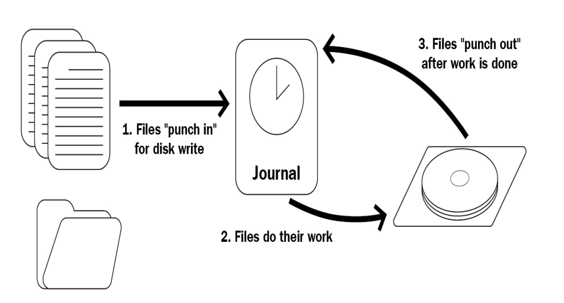
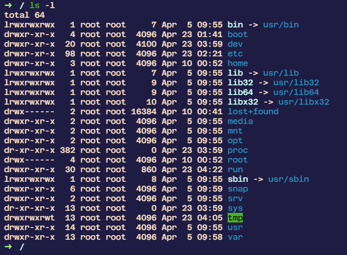
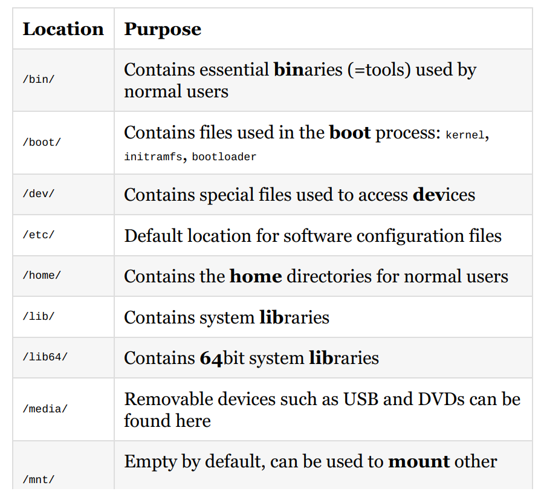
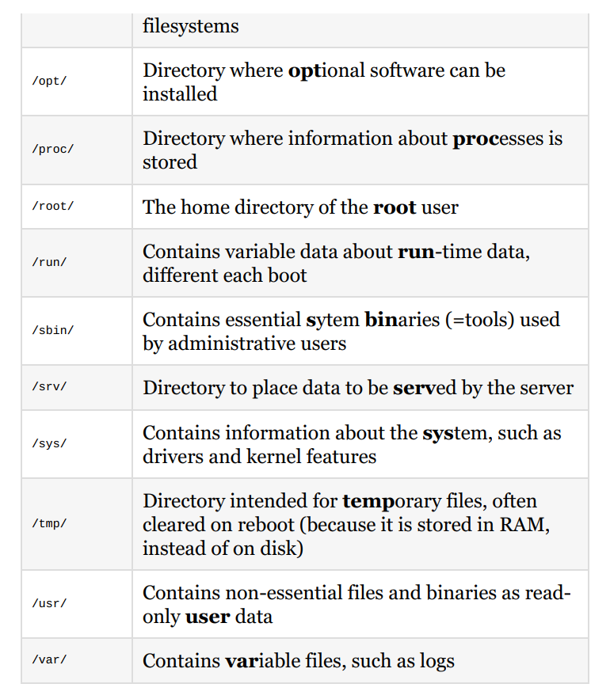
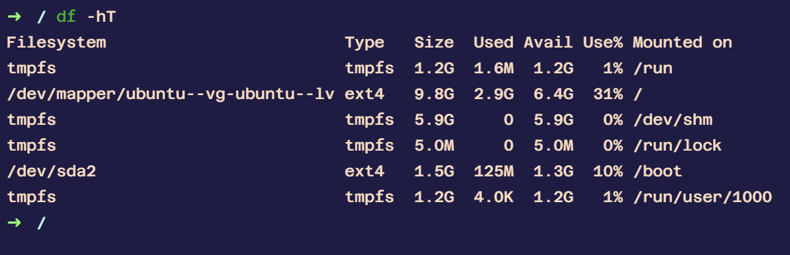
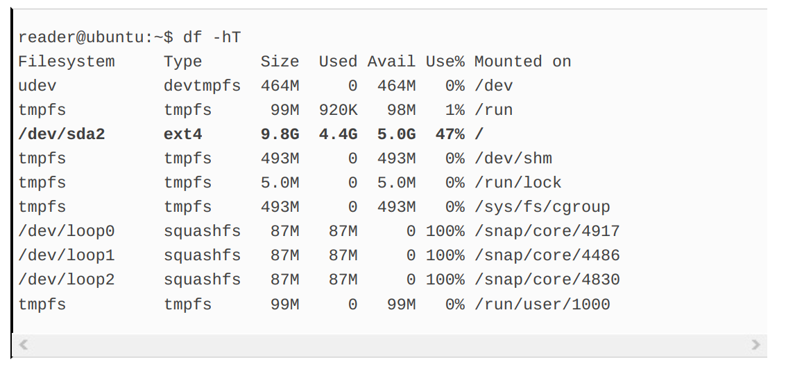
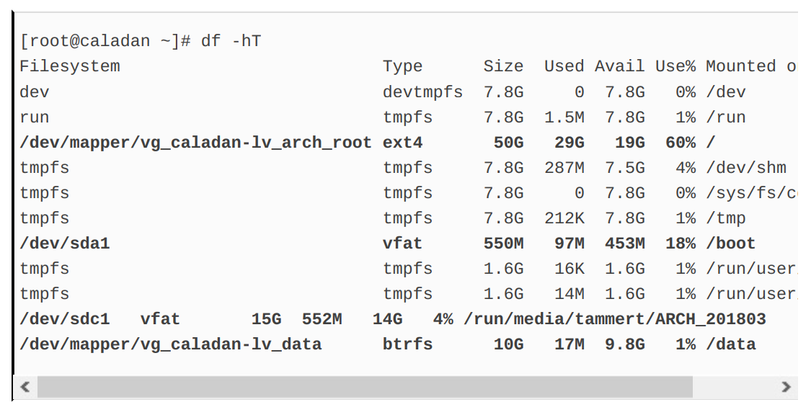
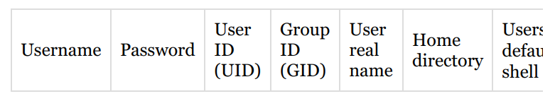
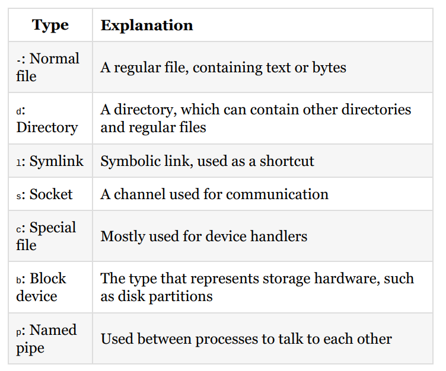

- [🍀 Technical requirements](#-technical-requirements)
- [🍀 The Linux filesystem explained](#-the-linux-filesystem-explained)
  - [🍃 What is a filesystem?](#-what-is-a-filesystem)
  - [🍃 What makes the Linux filesystem unique?](#-what-makes-the-linux-filesystem-unique)
- [🍀 Structure of the Linux filesystem](#-structure-of-the-linux-filesystem)
  - [🍃 Tree structure](#-tree-structure)
  - [🍃 Overview of top-level directories](#-overview-of-top-level-directories)
    - [🍁 What about multiple partitions?](#-what-about-multiple-partitions)
    - [🍁 /bin/, /sbin/, and /usr/](#-bin-sbin-and-usr)
    - [🍁 /etc/](#-etc)
    - [🍁 /opt/, /tmp/, and /var/](#-opt-tmp-and-var)
- [🍀 Everything is a file](#-everything-is-a-file)
  - [🍃 Different types of files](#-different-types-of-files)
- [🍀 Summary](#-summary)
- [🍀 Questions](#-questions)
- [🍀 Further reading](#-further-reading)

### 🍀 Technical requirements
****
We will explore the Linux filesystem using the virtual machine
we created in `Chapter 2`, Setting Up Your Local Environment.

`If you run into issues with connecting to your virtual machine, make sure that VirtualBox is running and the virtual machine has been started. While there are many things that can cause issues, making sure the hypervisor and virtual machine are running should always be your first step in troubleshooting.`

### 🍀 The Linux filesystem explained
****
This chapter will present the basics of the Linux filesystem.
Because filesystems are complicated, we will not be delving too
deeply into the guts of the technology; instead, we'll present just
enough information that's still relevant for shell scripting.

#### 🍃 What is a filesystem?
****
A filesystem is, in essence, the way data is stored and retrieved
on a physical medium (which can be a hard disk, solid state
drive, or even RAM). It is a software implementation that
manages where and how the bits are written and found again,
and may include various advanced features which enhance
reliability, performance, and functionality.

The concept of a filesystem is abstract: there are many filesystem
implementations, which are confusingly often referred to as
filesystems. We find it easiest to grasp by ordering the
filesystems in families, just as with Linux distributions: there are
Linux filesystems, Windows filesystems, macOS filesystems, and
many others. The Windows filesystem family spans from the
earliest filesystem of `FAT` up until the newest `ReFS`, with the
most widely used currently being `NTFS`.

At the time of writing, the most important filesystems in the
Linux family are the following implementations:

- `ext4`
- `XFS`
- `Btrfs`

The most commonly used Linux filesystem implementation is
currently `ext4`. It is the fourth iteration in the `extended file system (ext)` series of Linux filesystems. It was released in
2008 and is considered very stable, but it is not state-of-the-art;
reliability is the most important consideration.

`XFS` is most famously used in `Red Hat distributions` (Red Hat
Enterprise Linux, CentOS, and Fedora). It contains some
features that are more advanced than ext4, such as `parallel I/O`,
`larger file size support`, and `better handling of large files`.

Finally, there is `Btrfs`. This filesystem implementation was
initially designed at `Oracle` and is considered stable as of 2014.
`Btrfs` has many advanced features that could make it preferable
to `ext4` and `XFS`; the principal developer of `ext4` even stated that
`ext4` should eventually be replaced by `Btrfs`. The most interesting
feature of `Btrfs` is that it uses the `copy-on-write (COW)`
principle: `files that are copied aren't actually written out to the physical medium fully, but only a new pointer to the same data is created. Only when either the copy or the original gets modified is new data written.`

As you might have guessed, a filesystem implementation is
nothing more than software. For Linux, the three
implementations previously described are present in all newer
Linux kernels. This means that, as long as the correct drivers are
installed in the operating system, these can all be used. Even
better, all of these can even be used concurrently! We will
discuss this further later in this chapter.

Another interesting thing to note is that, while `ext4` is native to
Linux, with the help of drivers it can be used under, for example,
Windows as well. You would not use `ext4` as the filesystem for
the primary drive under Windows, but you could mount a Linux
formatted `ext4` filesystem under Windows and interact with the
contents. The other way around, mounting a Windows filesystem
under Linux, is also supported for most implementations. And
while we used `ext4` as the example here, the same goes for `XFS`
and `Btrfs`.

#### 🍃 What makes the Linux filesystem unique?
****
As should be clear by now, in reality, there is no such thing as the
Linux filesystem. However, these filesystems share certain
characteristics that make them viable as Linux filesystems.

A Linux filesystem adheres to the `Filesystem Hierarchy Standard (FHS).` This `FHS` is maintained by The Linux
Foundation and is currently up to version 3.0. As with many
things in the Linux ecosystem, it is based on a Unix predecessor:
the `Unix Filesystem Standard (UFS).` It specifies the
`directory structure` and its contents. We'll explore this
structure together in the next part of this chapter.

Since Linux is most commonly used in servers, Linux filesystem
implementations (often) have very advanced features on the
topic of `file integrity` and `disaster recovery`. An example of such a
disaster would be a system experiencing a `power outage` when it
was in the middle of `writing a business-critical file`. If the write
operation was stored in memory and aborted `halfway through`,
the file would be in an `inconsistent state`. When the system is
brought up again, the operating system does not have the write
operation in memory anymore (since memory is cleared on each
reboot), and only a part of the file will be written. Obviously, this
is unwanted behavior and can lead to problems. Because of the
properties of `COW`, `Btrfs` does not have this problem. However,
`ext4` and `XFS` are `not COW` filesystems. They both handle this
issue in another way: with journaling:



As the preceding diagram shows, files are written to disk in three
steps:

1. Filesystem requests disk write from journal
2. Journal writes on disk
3. After file write, journal is updated

If the server crashes between steps 2 and 3, the write will be
done again after power up, because the journal still contains the
entry. The journal only contains some metadata about the
operation, not the entire file. Since the journal contains a
reference to the actual location on disk (the drive sectors), it will
overwrite what was previously written, in this case, part of the
file. If it finished successfully this time, the journal entry will be
removed and the state of the file/disk is guaranteed. Should the
server fail between steps 1 and 2, the actual instruction to write
to disk has never been given and the software giving the
instruction should account for that possibility.

`Full disclosure: This part about `journaling`is a bit of an oversimplification, but again filesystems are complicated and we wantto focus on things that are relevant for shell scripting. If you're interested in how filesystems work on a lower level, be sure to pick up another book since it really is a very interesting subject!`

### 🍀 Structure of the Linux filesystem
****
While there are many more advanced filesystem features that are
very interesting, we want to focus on what makes the Linux
filesystem distinctively Linux: the filesystem structure. If you're
used to Windows, this will probably be the single most confusing
difference between the two operating systems. If you're coming
from macOS, the difference is still noticeable, but much smaller:
this is a result of macOS being a Unix operating system, which
has obvious similarities with the Unix-like Linux structure.

We're going to be interactively exploring the Linux filesystem
from this point on. We advise you to follow along with the code
examples that follow, since this increases information retention
significantly. Besides that, your system might look differently
from the one we use, should you have chosen not to use Ubuntu
18.04 LTS for this book. In any case, start up that virtual
machine and start exploring with us!.

#### 🍃 Tree structure
****
Let's start by logging in to our virtual machine via SSH:

```bash
🔥 -> ~ ssh -p 2222 reader@localhost
```

Enter your password at the prompt and you should arrive at the
default Ubuntu 18.04 login banner, which should look similar to
the following:

```bash
reader@localhost password:
Welcome to Ubuntu 18.04.1 LTS (GNU/Linux 4.15.0-29-generic x86_64)
<SNIPPED>
System information as of Sat Jul 28 14:15:19 UTC 2018
System load: 0.09 Processes: 87
Usage of /: 45.6% of 9.78GB Users logged in: 0
Memory usage: 15% IP address for enp0s3: 10.0.2.15
Swap usage: 0%
<SNIPPED>
Last login: Sat Jul 28 14:13:42 2018 from 10.0.2.2
reader@🔥:~$
```

When logging in (either via SSH or the Terminal console) you
will end up at the home directory of the user. You can always find
out where you are exactly by using the pwd command. pwd stands
for print working directory:

```bash
🔥 -> ~ pwd
/home/reader
```

So, we've ended up in the /home/reader/ directory. This is the default
for most Linux distributions: /home/$USERNAME/. Since we created the
primary user reader, this is where we expect to be. For those of
you coming from Windows, this might look very foreign: where
is the drive name (C:, D:, and so on) and why are we using
(forward) slashes instead of `backslashes`?

Linux, as well as Unix and other Unix-like systems, uses a `tree structure`. It is referred to as a tree because it starts at a `single origin point`, the root (found at /). Directories are nested from
there (like branches from a tree), not much differently from
other operating systems. Finally, the tree structure ends in `files`
that are considered the `leaves` of the tree. This might sound
terribly complicated still, but it's actually relatively simple. Let's
keep exploring to make sure we fully understand this structure!
Under Linux, we use the cd command to change directories. It
works by entering cd, followed by the location on the filesystem
where we want to go as the argument to the command. Navigate
to the filesystem `root`:

```bash
reader@🔥:~$ cd /
reader@🔥:/$

```

```bash
🔥 -> ~  / ls
bin  boot  dev  etc  home  lib  lib32  lib64  libx32  lost+found  media  mnt  opt  proc  root  run  sbin  snap  srv  sys  tmp  usr  var
```

As you can see, nothing much seems to have happened.
However, there is one tiny difference in your Terminal prompt:
the ~ character has been replaced by /. Under Ubuntu, the default
configuration shows the location on the filesystem without
needing to use the pwd command. The prompt is built as follows:
<username>@<hostname>:<location>$. Why the ~ then? Simple: the `tilde`
character is `shorthand` for the `user's home directory`! If the
shorthand wasn't there, the prompt at login would be

```bash
reader@🔥:/home/reader$.
```

Since we have navigated to the root of the filesystem, let's checkout what we can find there. To list the contents of the current
directory, we use the ls command:

```bash
reader@🔥:/$ ls
bin dev home initrd.img.old lib64 media opt root sbin srv sys usr vmlinuz
boot etc initrd.img lib lost+found mnt proc run snap swap.img tmp var vmlinuz
```

If you're using SSH, you'll most likely have some colors to
differentiate between files and directories (and even permissions
on directories, if you see tmp in a different manner; this will be
discussed in the next chapter). However, even with color
assistance, this still feels unclear. Let's clean it up a bit by using
an option on the ls command:



The option `-l` (hyphen lowercase l, as in long) to ls gives the `long listing format`. Among other things, this prints the
`permissions`, the `owner of the file/directory`, the `type of file`, and
its `size`. Remember, permissions and ownership are discussed in
the next chapter, so no need to worry about this for now. The
most important thing to take away from this is that each
`file/directory` is printed on its own line, where the first character
of that line denotes the type of file: `d` for `directory`, `-` for `regular`
`file`, and `l` for `symlinks` (which are `shortcuts` under `Linux`).

Let's navigate deeper into the tree structure, back toward our
home directory. At this point, you have two options. You can use a
relative path (as in: relative to the current location) or a fully
qualified path (which is not relative to the current directory).
Let's try both:

```bash
reader@🔥:/$ cd home
reader@🔥:/home$
```

The preceding is an example of changing directories into a
`relative` directory. We were positioned in the `root` directory, `/`,
and we navigated to `home` from there, effectively ending up in
`/home`. We could have navigated there `from anywhere` by using the
`fully qualified path`:

```bash
reader@🔥:/$ cd /home
reader@🔥:/home$
```

Did you spot the difference? In the fully qualified example, the
argument to cd started with a slash, but in the relative example it
did not. Let's see what happens if you use both types incorrectly:

```bash
reader@🔥:/home$ ls
reader
reader@🔥:/home$ cd /reader
-bash: cd: /reader: No such file or directory
```

We listed the contents of the `/home` directory with ls. As expected,
we saw (at least) the current user's home directory, reader.
However, when we tried to navigate to it using cd `/reader`, we got
the infamous error No such file or directory. This is not surprising
though: there isn't actually a directory `/reader`. The directory we're
looking for is `/home/reader`, which would be reached fully qualified
with the command `cd /home/reader`:

```bash
reader@🔥:/home$ cd home
-bash: cd: home: No such file or directory
reader@🔥:/home$
```

The same error is presented if we try to use an incorrect relative
path. In the preceding example, we are currently located in the
`/home` directory and we use the cd home command. Effectively, this
would put us in `/home/home`, which, as we saw when we used ls in
the `/home` directory, does not exist!

`The safest way to navigate around Linux is fully qualified: as long as you have the correct directory, it always works, no matter where you are currently located on the filesystem. However, especially when you get deeper into the filesystem, you're typing a lot more. We always recommend beginning users to start with fully qualified navigation and switch to relative once they're comfortable with the cd, ls, and pwd commands.`

Even though `fully qualified` is `safer`, it's much `less efficient` then
`relative`. You saw how we can move deeper into the branches of
the tree structure, but what if you had to go down a level, back
toward the root? Luckily for us, that does not force us to use fully
qualified paths. We can use the `..` notation, which means as
much as `go up a level toward /:`

```bash
reader@🔥:/home$ cd ..
reader@🔥:/$
```

`A note on terminology is in order here. While we conceptualized the filesystem as a tree, when talking about the root directory, we consider this as the highest point in the filesystem. So when moving from / to /home, we're moving down. If we use the command cd .. to move back to /, we're moving up. While we think that this doesn't really match with the picture of a tree (where the root is actually the lowest point), please remember this convention! `

Using cd .. to move up lands us back at the root of the filesystem.
At this point, you might think If I do this again while I'm on the
highest level of the filesystem, what would happen?. Give it a
try:

```bash
reader@🔥:/$ cd ..
reader@🔥:/$
```

Fortunately for us, we do not get an error nor a crashing
machine; instead, we just end up (or, depending on how you look
at it, stay) on the root of the filesystem.

`A source of confusion among new users of Linux is often the term root. It can stand for any of three things:`

1. The `lowest` point in the filesystem, at` /`
2. The `default superuser`, named just `root`
3. The `default superuser's home` `directory`, at `/root/`

`Often, it is left to the reader to use context to determine which of the three is meant. When talking in the context of filesystems, it will probably be: `

1. If it seems to be `referring` to a `user`, you can expect it to mean the
   `root user`
2. Only when talking about the `root` `user's` `home directory` or
   `/root/` should you think of
3. Most often, you will encounter root to mean either 1 or 2!

#### 🍃 Overview of top-level directories
****
Now that we've got the basics of moving around using `cd` and
listing directory contents using `ls` under control, let's start
exploring other parts of the filesystem. Let's begin with an
overview of every directory directly under the root filesystem, as
specified by the `FHS` :




While each and every top-level directory has an important
function, there are a few we're going to examine more closely
since we're undoubtedly going to encounter them in our shell
scripting. These are /bin/, /sbin/, /usr/, /etc/, /opt/, /tmp/, and /var/.

##### 🍁 What about multiple partitions?
****
But first, we'd like to briefly address something you might have
found confusing, especially if you're coming from a Windows
background where you're used to `multiple disks/partitions` in the
form of `C:\, D:\, E:\,` and so on. With the preceding directory
structure, and the information that the `highest` point in the
filesystem is at` /`, how does `Linux deal with multiple disks/partitions?`

The answer is actually pretty simple. Linux mounts filesystems
somewhere within the tree structure. The first mount is found on
the primary partition we have already covered: it is mounted on
/! Let's see how this looks while we check out a new df tool:




While this is a lot of output by `df (which reports filesystem disk space usage)`, the most interesting was highlighted previously:
the partition `/dev/sda2` of type `ext4` (remember?) is mounted on /.
You're getting a preview of the everything is a file later in this
chapter: `/dev/sda2` is `handled as a file`, `but it is actually a reference to a partition on the disk (which is, in this case, a virtual disk).`
Another example from our `Arch Linux` host gives even more
information (don't worry if you don't have a Linux host, we'll
explain later):


You can see I have an `ext4` filesystem mounted as my `root`.
However, I also have an extra `btrfs` partition mounted on `/data/`
and a `vfat` boot partition `(which is needed on bare-metal installations, but not on virtual machines)` on `/boot/`. To top it off,
there's also a `vfat` `USB device` with the `Arch Linux installer`
connected, which was automatically mounted under `/run/media/`.
So `not only does Linux handle multiple partitions or disks gracefully, even different types of filesystems can be used side by side under the same tree structure!`

##### 🍁 /bin/, /sbin/, and /usr/
****
Let's get back to top-level directories. We'll discuss `/bin/`, `/sbin/`,
and `/usr/` first, because they are really similar. As stated in the
overview, `all of these directories contain binaries used by normal users and administrators of the system`. Let's see where those
binaries are and how our user session knows how to find them in
the process. We'll manage this by using the `echo` command. Its
short description is simply display a line of text. Let's see how it
works:

```bash
reader@🔥:~$ echo
reader@🔥:~$ echo 'Hello'
Hello
reader@🔥:~$
```

If we use echo without passing an argument, an empty line of text
is displayed (pretty much just as promised by the short
description!). If we pass text, which we enclose in single quotes,
that text is printed instead. In this context, a bit of text which
contains either letters, numbers, or other characters is referred
to as a `string`. So, any string we pass to echo will be printed in our
Terminal. While this might not seem that interesting, it is
interesting when you start to consider `variables`. `A variable is a string which value` is, as the name implies, variable from time to
time. Let's use echo to print the current value of the variable
BASH_VERSION:

```bash
reader@🔥:~$ echo BASH_VERSION
BASH_VERSION
reader@🔥:~$ echo $BASH_VERSION
4.4.19(1)-release
reader@🔥:~$
```

You should notice we did not use the echo BASH_VERSION command,
since that would print the literal text BASH_VERSION, but we instead
started the `variable` name with a `$`. In Bash, the `$` denotes the fact
that we're using a `variable` (we will explain variables and
variable interpolation further in Chapter 8, Variables and User
Input). Why are we telling you this? Because the binaries we can
use from our Terminal are found by using a variable, specifically
the PATH variable:

```bash
reader@🔥:~$ echo $PATH
/usr/local/sbin:/usr/local/bin:/usr/sbin:/usr/bin:/sbin:/bin <SNIPPED>
reader@🔥:~$
```

As you can see here, binaries need to be in the `/usr/local/sbin/`,
`/usr/local/bin/`, `/usr/sbin/`, `/usr/bin/`, `/sbin/`, or `/bin/` directory for us to
be able to use them (with the current value of PATH, which we can
change, but that's out of scope for now). That would mean that
`binaries` we've been using up until now (`cd, ls, pwd, and echo`) would
need to be in one of these directories so that we can use them,
right? Unfortunately, this is where things get slightly
complicated. On Linux, we basically use `two` types of `binaries`:
those that are found on `disk` `(in a directory as specified by the PATH variable)`, or `they can be built into the shell we're using`, then
called a `shell builtin`. A good example is actually the echo
command we just learned, which is both! We can see what type
of command we're dealing with by using type:

```bash
reader@🔥:~$ type -a echo
echo is a shell builtin
echo is /bin/echo
reader@🔥:~$ type -a cdcd is a shell builtin
reader@🔥:~$
```

`If a command is both built-in and a binary within the PATH, the binary is used`. If it is only present as a built-in, such as cd, the
built-in is used. As a general rule, most commands you use will
be binaries on disk, as found in your PATH. Furthermore, most of
these will be present in the `/usr/bin/` directory (on our Ubuntu
virtual machine, `more than half of the total binaries are present in /usr/bin/!)`.

So, the overall goal of the binary directories should be clear: to
provide us with the tools we need to perform our work. The
question remains, `why are there (at least) six different directories, and why are they divided between bin and sbin?` The
answer to the last part of the question is easy: `bin has normal utilities used by users`, while `sbin has utilities used by system administrators`. In that last category, tools related to disk
maintenance, network configuration, and firewalling, for
example, are found. The bin directories contain utilities that are
used for filesystem operations (such as creating and removing
files/directories), archiving, and listing information about the
system, among others.

The difference between the top-level `/(s)bin/` and `/usr/(s)bin/` is a
bit more `vague`. In general, the rule is that `essential tools are found in /(s)bin`, while `system-specific binaries are placed in the /usr/(s)bin directories`. So if you installed a package to run a web
server, it would be placed in either` /usr/bin/` or `/usr/sbin/`, since it is
system-specific. Finally, the `/usr/local/(s)bin/` directories are, in our
experience, most often used for `binaries that are installed manually`, `instead of from a package manager`. But you could
place them in either directory of the PATH to work; it's mostly a
matter of convention.

As a final note, `/usr/` contains `more than just binaries`. Among
these are some libraries (which have the same relation to the
`/lib/` and `/lib64/` top-level directories) and some miscellaneous
files. If you're curious, we would definitely recommend checking
out the rest of the `/usr/` directory using `cd` and `ls`, but the most
important thing to remember is that binaries and libraries
can be located here.

##### 🍁 /etc/
****
On to the next interesting top-level directory within the Linux
filesystem: the `/etc/` directory. Pronounced `et-c` as in `et-cetera`, it
is used to store `configuration files` for both `system software` as
well as `user software`. Let's see what it contains:

```bash
reader@🔥:/etc# ls
acpi console-setup ethertypes inputrc logrotate.conf network python3 shadow ucf.conf
...<SNIPPED>:
```

We snipped the preceding output to only the top line of our
system. If you followed along with the example (and you should!)
you will see well over 150 files and directories. We will print a
particularly interesting one using the cat command:

```bash
reader@🔥:/etc$ cat fstab
UUID=376cd784-7c8f-11e8-a415-080027a7d0ea / ext4 defaults 0 0
/swap.img none swap sw 0 0
reader@🔥:/etc$
```

What we're seeing here is the `file systems table`, or `fstab` file. It
contains the instructions for Linux to `mount the filesystems` at
`each start`. As we can see here, we're referencing a partition by its
`Universally Unique Identifier (UUID)` and we're mounting
it on `/`, so as the `root filesystem`. It's of type `ext4`, mounted using
options `defaults`. The `last two zeros` deal with `backups` and `checks`
at the start of the system. On the second line, we see we're using
a file as `swap space`. `Swap is used in case there isn't enough memory available to the system`, `which can be compensated forby writing it to disk (but incurring a hefty performance penalty, since a disk is much slower than RAM).`

Another interesting configuration file in the `/etc/` directory is the
`passwd` file. While it sounds like password, don't worry, those
aren't stored there. Let's check the contents using the `less`
command:

```bash
reader@🔥:/etc$ less passwd
```

This will open the file in a so-called pager, in `read-only` mode.
less uses `Vim` commands, so you can quit by pressing the `Q` on
your keyboard. If the file is larger than your screen, you can
navigate up and down with the `Vim keystrokes`: either the `arrow keys` or by using `J` and `K`. When in the less, the screen should look
something like the following:

```bash
root:x:0:0:root:/root:/bin/bash
daemon:x:1:1:daemon:/usr/sbin:/usr/sbin/nologin
...<SNIPPED>:
sshd:x:110:65534::/run/sshd:/usr/sbin/nologin
reader:x:1000:1004:Learn Linux Shell Scripting:/home/reader:/bin/bash
```

This file contains information about all users on the system. In
order, the fields separated by the : denote the following:



While there is a password field here, this is because of legacy reasons; the (hashed!) `password` has been moved to the `/etc/shadow`
file, which can only be read by the `root superuser`. We will cover
the `UID` and `GID` in the next chapter; the other fields should be
clear by now.

These are just two examples of configuration files found in the
`/etc/ directory` (important ones though!).

##### 🍁 /opt/, /tmp/, and /var/
****
On a fresh installation of Ubuntu, the `/opt/` directory is `empty`.
While it is again a matter of convention, in our experience, this
directory is most often used to `install software that comes from outside the distribution's package manager`. However, `some applications that are installed with the package manager do use /opt/ for their files`; it's all a matter of preference by the package
maintainer. In our case, `we will be using this directory to save the shell scripts we'll be creating`, as these definitely classify as
optional software.

The `/tmp/` directory is used for temporary files (who would have
guessed?). In some Linux distributions, `/tmp/` is not part of the
root partition but mounted as a separate `tmpfs filesystem`. This
type of filesystem is allocated within the RAM, which means the
contents of `/tmp/ do not survive a reboot`. Since we're dealing with
temporary files, this is sometimes not only a nice feature, but a
prerequisite for particular uses. For a desktop Linux user, this
could for example be used to save a note which is only needed
during the active session, without having to worry about cleaning
it up after you're done.

Finally, the `/var/` directory is a little more complex. Let's have a
look:

```bash
reader@🔥:~$ cd /var/
reader@🔥:/var$ ls -l
total 48
drwxr-xr-x 2 root root 4096 Jul 29 10:14 backups
drwxr-xr-x 10 root root 4096 Jul 29 12:31 cache
drwxrwxrwt 2 root root 4096 Jul 28 10:30 crash
drwxr-xr-x 35 root root 4096 Jul 29 12:30 libdrwxrwsr-x 2 root staff 4096 Apr 24 08:34 local
lrwxrwxrwx 1 root root 9 Apr 26 19:07 lock -> /run/lock
drwxrwxr-x 10 root syslog 4096 Jul 29 12:30 log
drwxrwsr-x 2 root mail 4096 Apr 26 19:07 mail
drwxr-xr-x 2 root root 4096 Apr 26 19:07 opt
lrwxrwxrwx 1 root root 4 Apr 26 19:07 run -> /run
drwxr-xr-x 3 root root 4096 Jun 30 18:20 snap
drwxr-xr-x 4 root root 4096 Apr 26 19:08 spool
drwxrwxrwt 4 root root 4096 Jul 29 15:04 tmp
drwxr-xr-x 3 root root 4096 Jul 29 12:30 www
reader@🔥:/var$
```

As you should see, `/var/` contains many subdirectories and some
`symlinks` (which are denoted by the `->` characters). In this case,
`/var/run/` is actually a shortcut to the top-level directory `/run`. The
most interesting subdirectories within `/var/ (for now)` are `log/` and
`mail/`.

`/var/log/` is conventionally used to save log files for most system
and user processes. In our experience, most third-party software
installed on a Linux system will adhere to this convention and
will output `log files` to the `/var/log/` directory, or create a
subdirectory in `/var/log/`. Let's look at an example of a log file
using less with a fully qualified path:

```bash
reader@🔥:~$ less /var/log/kern.log
```

In the less pager, you'll encounter something which looks similar
to the following:

```bash
Jun 30 18:20:32 ubuntu kernel: [ 0.000000] Linux version 4.15.0-23-generic (buildd@lgw01-am
Jun 30 18:20:32 ubuntu kernel: [ 0.000000] Command line: BOOT_IMAGE=/boot/vmlinuz-4.15.0-23
Jun 30 18:20:32 ubuntu kernel: [ 0.000000] KERNEL supported cpus:
Jun 30 18:20:32 ubuntu kernel: [ 0.000000] Intel GenuineIntel
Jun 30 18:20:32 ubuntu kernel: [ 0.000000] AMD AuthenticAMD
...<SNIPPED>:
```

This log file contains information about the `kernel boot process`.
You can see a reference to the actual kernel on disk, `/boot/vmlinuz- 4.15.0-23-generic`, and the `UUID` of the filesystem being mounted at
root, `UUID=376cd784-7c8f-11e8-a415-080027a7d0ea`. This file would be
something you would check if your system has trouble booting or
if some functionality does not seem to be working!

In the earliest days of Unix and Linux, sending mail was
something that wasn't only used over the internet (which was in
its mere infancy at that time), but also to relay messages between
servers or users on the same server. On your new Ubuntu virtual
machine, the `/var/mail/` directory and its `symlink`, `/var/spool/mail/`,
will be empty. However, once we start talking about `scheduling`
and `logging`, we will see that this directory will be used to store
messages.

That concludes the short description about the top-level
directories in the default Linux filesystem. We discussed the
most important ones, in our eyes, when relating to shell
scripting. However, in time, you will get a feeling for all
directories and finding anything on the Linux filesystem will
surely get a lot easier, as difficult as it might sound right now.

### 🍀 Everything is a file
****
Under Linux, there is a well-known expression:

`On a Linux system, everything is a file; if something is not a file, it is a process.`
While this is not strictly 100% true, it is true for at least 90% of
things you will encounter on Linux, definitely if you're not very
advanced yet. Even though, in general, this rule works out, it has
some extra notes. While most stuff on Linux is a file, there are
different file types, seven to be exact. We'll discuss them all in
the coming pages. You will probably not use all seven; however,
having basic knowledge about them all gives you a better
understanding about Linux in general, something which is never
a bad thing!

#### 🍃 Different types of files
****
The seven types of files are as follows, denoted with the character
used by Linux to represent them:



Out of these seven file types, you will first encounter just the
`regular files` `(-)` and the `directories` `(d)`. Next, you will probably
interact some more with `symlinks` `(l)`, `block devices` `(b)`, and
`special files` `(c)`. Very rarely will you use the last two: `sockets` `(s)` and `named pipes` `(p)`.

A good place to encounter the most common file types is in /dev/.
Let's use ls to see what it contains:

```bash
reader@🔥:/dev$ ls -l /dev/
total 0
crw-r--r-- 1 root root 10, 235 Jul 29 15:04 autofs
drwxr-xr-x 2 root root 280 Jul 29 15:04 block
drwxr-xr-x 2 root root 80 Jul 29 15:04 bsg
crw-rw---- 1 root disk 10, 234 Jul 29 15:04 btrfs-control
drwxr-xr-x 3 root root 60 Jul 29 15:04 bus
lrwxrwxrwx 1 root root 3 Jul 29 15:04 cdrom -> sr0
drwxr-xr-x 2 root root 3500 Jul 29 15:04 char
crw------- 1 root root 5, 1 Jul 29 15:04 console
lrwxrwxrwx 1 root root 11 Jul 29 15:04 core -> /proc/kcore
...<SNIPPED>:
brw-rw---- 1 root disk 8, 0 Jul 29 15:04 sda
brw-rw---- 1 root disk 8, 1 Jul 29 15:04 sda1
brw-rw---- 1 root disk 8, 2 Jul 29 15:04 sda2
crw-rw---- 1 root cdrom 21, 0 Jul 29 15:04 sg0
crw-rw---- 1 root disk 21, 1 Jul 29 15:04 sg1
drwxrwxrwt 2 root root 40 Jul 29 15:04 shm
crw------- 1 root root 10, 231 Jul 29 15:04 snapshot
drwxr-xr-x 3 root root 180 Jul 29 15:04 snd
brw-rw---- 1 root cdrom 11, 0 Jul 29 15:04 sr0
lrwxrwxrwx 1 root root 15 Jul 29 15:04 stderr -> /proc/self/fd/2
lrwxrwxrwx 1 root root 15 Jul 29 15:04 stdin -> /proc/self/fd/0
lrwxrwxrwx 1 root root 15 Jul 29 15:04 stdout -> /proc/self/fd/1
crw-rw-rw- 1 root tty 5, 0 Jul 29 17:58 tty
crw--w---- 1 root tty 4, 0 Jul 29 15:04 tty0
crw--w---- 1 root tty 4, 1 Jul 29 15:04 tty1
...<SNIPPED>:
reader@🔥:/dev$
```

As you saw from your output, `/dev/` contains a lot of files, with
most of the types as outlined above. Ironically, it does not
contain the most common file type: regular files. However,
because we have been interacting with regular files until now,
you should have an idea about what they are (and otherwise the
rest of the book will definitely give you an idea).

So, let's look at anything other than a regular file. Let's start with
the most familiar: `directories`. Any line that starts with a `d` is a
directory, and, if you're using SSH, will most probably be
represented in a different color as well. Do not underestimate
how important this visual aid is, as it will save you a lot of time
when you're navigating a Linux machine. Remember, you can
move into a directory by using either `cd` with a relative path or a
fully qualified path, which always starts from the root of the
filesystem.

Next, you will see files starting with the `b`. These files are used to
represent `block devices`, the most common usage being a `disk device or partition`. Under most Linux distributions, disks are
often called `/dev/sda`, `/dev/sdb`, and so on. Partitions on those disks
are referred to with a `number`: `/dev/sda1`, `/dev/sda2`, and further. As
you can see in the preceding output, our system has a single disk
`(only /dev/sda)`. That disk does, however, have two partitions:
`/dev/sda1` and `/dev/sda2`. Try using `df -hT` again, and you will notice
`/dev/sda2` mounted as the `root filesystem (unless your virtual machine was configured differently, in which case it might be /dev/sda1 or even /dev/sda3)`.

`Symlinks` are often used on Linux. Look in the preceding output
for the entry `cdrom`, which you will see starts with an `l`. The term
`cdrom` has contextual meaning: it refers to the CD (or more
probably, in a newer system, the DVD) drive. However, it is
linked to the actual block device that handles the interaction,
`/dev/sr0`, which starts with the `b` for `block device`. Using a symlink
makes it easy to find the item you need (the disk drive) while still
preserving the Linux configuration which calls the `device handler sr0`.

Finally, you should see a long list of files called `tty`. These are
denoted by a `c` at the beginning of the line, indicating a `special file`. To keep it simple, you should consider a `tty as a Terminal

you use to connect to your Linux server`. `These are a kind of
virtual device that Linux uses to allow interaction from the user
with the system. Many virtual and physical devices use the
special file handlers when they appear on your Linux filesystem.`

`This chapter introduced you to many commands. Perhaps you have gotten sick of typing everything already, perhaps not. In any case, we have some good news: Bash has something called autocomplete. It is something we did not want to introduce to early as to avoid confusion, but it is something that is used so extensively when working with a Linux system that we would be cheating you if we had not explained it. `

`It's actually pretty simple: if you hit the Tab key after the first part of a command (such as cd or ls), it will complete your command if it has a single choice, or if you hit Tab again, it will present you a list of options. Go to /, type cd, and press Tab twice to see this in action. Moving into the /home/ directory and pressing Tab once (after entering cd) will make it autocomplete with the only directory there is, saving you time!`

### 🍀 Summary
****
In this chapter, we presented an overview of the Linux
filesystem. We started with a short introduction on filesystems in
general, before explaining what is unique about the Linux
filesystem. Ext4, XFS, and Btrfs filesystem implementations
were discussed, together with the journaling feature of these
filesystems. Next, the FHS that Linux adheres to was explained
in high level, before focusing on the more important parts of the
Linux filesystem in detail. This was done by exploring parts of
the tree structure that makes up the Linux filesystem. We
explained that different filesystems can be used side by side, by
mounting them somewhere inside the tree. We ended the
chapter by explaining that (almost) everything on Linux is
handled as a file, and we discussed the different file types that
are used.

The following commands were introduced in this chapter: pwd, cd,
df, echo, type, cat, and less. As a tip, the Bash autocomplete feature
was explained.

### 🍀 Questions
****
1. What is a filesystem?
2. Which Linux-specific filesystems are most common?
3. True or false: multiple filesystem implementations can be
   used concurrently on Linux?
4. What is the journaling feature present on most Linux
   filesystem implementations?
5. On which point in the tree is the root filesystem
   mounted?
6. What is the PATH variable used for?
7. In which top-level directory are configuration files stored
   according to the FHS?
8. Where are process logs commonly saved?
9. How many file types does Linux have?
10. How does the Bash autocomplete function work?

### 🍀 Further reading
****
The following resource might be interesting if you'd like to go
deeper into the subjects of this chapter:

- General overview of the Linux filesystem: https://www.tldp.org/LDP/intro-linux/html/sect_03_01.html
