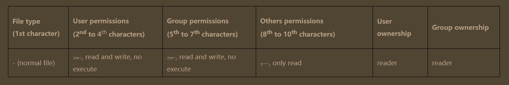

- [Technical requirements](#technical-requirements)
- [Read, write, and execute](#read-write-and-execute)
  - [RWX](#rwx)
- [Users, groups, and others](#users-groups-and-others)
- [Manipulating file permissions and ownership](#manipulating-file-permissions-and-ownership)
  - [chmod, umask](#chmod-umask)
  - [sudo, chown, and chgrp](#sudo-chown-and-chgrp)
    - [sudo](#sudo)
    - [chown, chgrp](#chown-chgrp)
### Technical requirements
We will explore the Linux permissions scheme using the virtual
machine we created in Chapter 2, Setting Up Your Local
Environment. During this chapter, we will add new users to this
system, but only having access as the first user (which has
administrative, or root privileges) is sufficient at this point.

### Read, write, and execute
In the previous chapter, we discussed the Linux filesystem and
the different types with which Linux implements the everything
is a file philosophy. However, we did not look at `permissions` on
those files. As you might have guessed, in a `multi-user` system
such as a `Linux server`, it is not a particularly great idea that
users can `access` files which are owned by other users. Where
would the `privacy` be in that?

The Linux permissions scheme is actually at the heart of the
Linux experience, as far as we are concerned. Just as (almost)
everything is handled as a `file` in `Linux`, all of those files have a
distinct set of permissions accompanying them. While exploring
the file system in the previous chapter, we limited ourselves to
files that were viewable by either everyone or by the `currently`
`logged` in `user`. However, there are many files that are only
`viewable` or `writable` by the `root` `user`: often, these are sensitive
files such as `/etc/shadow` `(which contains the hashed passwords for
all users)`, or files which are used when `starting the system`, such
as `/etc/fstab` `(which determines which file systems are mounted at
boot)`. If everyone could edit those files, it could result in an
`unbootable` system very quickly!

#### RWX
File `permissions` under Linux are handled by three attributes:
`read`, `write`, and `execute`, or `RWX`. While there are other
permissions (some of which we will discuss later in this chapter),
most interactions with regards to permissions will be handled by
these three. Even though the names seem to speak for
themselves, they behave differently with regards to `(normal)` files
and `directories`. The following table should illustrate this:

Allows the user to see the contents of the file with any command
that supports this, such as `vim`, `nano`, `less`, `cat`, and so on.

| Permission | On normal files                                                                                                                                                                            | On directories                                                                                                                                                                                                                                                                       |
| :--------- | :----------------------------------------------------------------------------------------------------------------------------------------------------------------------------------------- | :----------------------------------------------------------------------------------------------------------------------------------------------------------------------------------------------------------------------------------------------------------------------------------- |
| Read       | Allows the user to list the contents of the directory using the `ls` command.This will even list files in the directory on which the user has no other privileges!                         | Allows the user to list the contents of the directory using the `ls` command.This will even list files in directory on which the user has no other privileges!                                                                                                                       |
| Write      | Allows the user to make changes to the file.                                                                                                                                               | Allows the user to replace or delete files within the directory, even if the user has no direct permissions on that file. However, this does not include read permissions on all files within the directory!                                                                         |
| Execute    | Allows the user to execute the file. This is only relevant when the file is something that is supposed to be executed, such as a binary or script; otherwise, this attribute does nothing. | Allows the user to traverse into the directory by using cd. This is a separate permission from the listing of contents, but they are almost always used together; being able to list without being able to navigate into it (and vice versa) is mostly an ineffective configuration. |

This overview should provide a basis for the three different
permissions. Please take a good look and see whether you can
fully understand what is presented there.

Now, it's about to get a little more complicated. While these
permissions on both files and directories show what can and
cannot be done for a `user`, how does Linux deal with multiple
users? How does Linux keep track of `file` `ownership`, and how are
files shared by `multiple` `users`?

### Users, groups, and others

Under Linux, every file is `owned` by exactly `one` `user` and `one`
`group`. Every user has an `identifying` `number`, the `User ID`
`(UID)`. The same applies for a `group`: it is resolved by a `Group
ID` `(GID)`. Every `user` has exactly `one` `UID` and one `primary`
`GID`; however, users can be members of `multiple groups`. In that
case, the user will have one or more supplementary GIDs. You
can see this for yourself by running the id command on your
Ubuntu machine:

```bash
➜  ~ id
uid=1000(chamara) gid=1000(chamara) groups=1000(chamara),4(adm),24(cdrom),27(sudo),30(dip),46(plugdev),110(lxd)
```
In the preceding output, we can see the following things:
- The `uid` for the chamara `user` is 1000; Linux typically starts
numbering `normal` `users` at `1000`
- The `gid` is 1004, which corresponds to the chamara `group`; by
`default`, Linux creates a `group` with the `same` `name` as the
`user` `(unless told specifically not to)`
- Other groups include adm, sudo, and others.

What does this mean? The `current logged-in user has a uid of 1000`,
a `primary gid of 1004`, and a few `supplementary groups`, which
makes sure that it has `other privileges`. For example, under
`Ubuntu`, the `cdrom` group allows the user to have `access to the disk
drive`. The `sudo` group allows the user to perform `administrative
commands`, and the `adm group` allows the user to `read
administrative files`.

*While we typically refer to users and groups by name, this is just a
representation for the `UIDs` and `GIDs` that Linux provides us with. On a
system level, only the `UID` and `GIDs` are `important` for `permissions`. This
makes it possible, for example, to have `two users with the same`
username but `different UIDs`: the permissions for those users will not be
the same. `The other way around is also possible: two different
usernames with the same UID`—this causes the permissions for both
users to be the same, at least on the `UID level`. However, both situations
are terribly confusing and should not be used! As we'll see later on, using
groups to share permissions is by far the best solution for sharing files
and directories*.

*Another thing to keep in mind is that `UIDs and GIDs` are `local` to the
`machine`. So if I have a user named `bob` with UID 1000 on `machine A`,
and UID 1000 is mapped to user `alice` on `machine B`, transferring bob's
files from machine A to machine B would result in the files being owned
by alice on system B!*

The `RWX` permissions explained previously relate to the users
and groups we're discussing now. In essence, every file (or
directory, which is just a different type of file), has the following
attributes:

- The file is owned by a user, which has (part of) the `RWX`
permissions
- The file is also owned by a `group`, which again, has (part
of) the `RWX` permissions
- The file finally has `RWX` permissions for others, which
means all different users that don't share the group

To determine if a user can read, write, or execute a file or
directory, we need to look at the following attributes (not necessarily in this order):

- Is the user the `owner` of the file? What `RWX` permissions
does the owner have?
- Is the user part of the `group` that owns the file? What
`RWX` permissions have been set for the group?
- Does the file have enough `permissions` on the `others`
`attribute`?

Let's look at some simple examples before it gets too abstract. On
your virtual machine, follow along with the following commands:

```bash
➜  ~ pwd
/home/chamara
➜  ~ ls -l
total 8
-rw-rw-r-- 1 chamara chamara 29 Apr 22 03:12 nano-test.txt
-rw-rw-r-- 1 chamara chamara 81 Apr 23 01:55 test.txt
➜  ~ touch nano-test.txt  
➜  ~ 
```

First, we ensure that we are in the home directory for the chamara
user. If not, we can move back there by using the `cd
/home/chamara` command or, `alternatively`, by just entering `cd` `(without
an argument`, `cd defaults to the user's home directory!`). We proceed
by listing the contents of the directory in the `long format`, using
`ls -l`, which shows us one file: `nano-test.txt`, from Chapter 2, Setting
Up Your Local Environment (don't worry if you didn't follow
along there and do not have the file; we'll be creating and
manipulating files in a little bit). We use a new command, `touch`,
to `create an empty file`. The argument we specify for `touch` is
interpreted as the `file name`, as we can see when we list the files
again:


```bash
➜  ~ ls -l
total 8
-rw-rw-r-- 1 chamara chamara 29 Apr 24 02:07 nano-test.txt
-rw-rw-r-- 1 chamara chamara 81 Apr 23 01:55 test.txt
➜  ~ 
```

You'll see the permission followed by two names: the `username`
and the` group name` (in that order!). For our `testfile`, the user
chamara and members of the chamara group can both read and write to
the file, but cannot execute (on the position of the x, there is
instead a -, indicating an absence of that permission). All other
users, such as those that are neither chamaras nor part of the
chamara group (which, in this case, is really all other users), can
only read the file due to the permission of others. This is also
described in the following table:



If a file had `full permissions` for everyone, it would look like this:
`-rwxrwxrwx`. For files that have all permissions for the `owner` and the
`group`, but none for others, it would be `-rwxrwx---`. `Directories`
with `full permissions on user and group`, but `none for others`, are
represented as `drwxrwx---`.

Let's look at another example:

```bash
 ls -l /
drwx------   4 root root  4096 Apr 10 00:52 root
dr-xr-xr-x 381 root root     0 Apr 23 03:59 proc
drwxr-xr-x  30 root root   880 Apr 24 01:16 run
➜  ~ 
```

The home directory for the systems' superuser is `/root/`. We can see
from the first character on the line that it is a `d`, for `directory`. It
has `RWX` (one last time: read, write, execute) permissions for the
owner root, and no permissions for the group (also root), nor for
others (as denoted by ---). These permissions can only mean one
thing: `only the user root can enter or manipulate this
directory`! Let's see if our assumption is correct. Remember,
`entering a directory requires the x permission`, while `listing the
directory contents the r permission`. We should not be able to do
either, since we're neither the root user or in the root group. In
this case, the permissions of others will be applied, this being `---:`

```bash
➜  ~ cd /root/
cd: permission denied: /root/
➜  ~ ls /root/
ls: cannot open directory '/root/': Permission denied
➜  ~ 
```
### Manipulating file permissions and ownership

After reading the first part of this chapter, you should have a
decent understanding of Linux file permissions, and how read,
write, and executed are used on a user, group, and other levels to
ensure that files are exposed exactly as required. However, up
until this point, we've been dealing with static permissions.
When administering a Linux system, you will most likely spend a
fair bit of time adjusting and troubleshooting permissions. In
this part of the book, we'll be exploring the commands we can
use to `manipulate` the `permissions` on `files`.

#### chmod, umask
Let's circle back to our `testfile`. It has the following permissions: `-
rw-rw----`. `Read/writable by user and group`, `readable by others`.
While these permissions might be fine for most files, they are
definitely not a great fit for all files. `What about private files?
You would not want those to be readable by everyone, perhaps
not even by group members`.

The Linux command to `change permissions` on a `file or directory`
is `chmod`, which we like to read as change file mode. `chmod` has two
operating modes: `symbolic mode` and `numeric/octal` mode. We
will begin by explaining `symbolic mode (which is easier to
understand)`, before we move to `octal mode (which is faster to
use)`.

*Something we have not yet introduced is the command to view manuals
for commands. The command is simply `man`, followed by the command for
which you'd like to see the manual of. In this case, `man chmod` will place us
into the `chmod manual pager`, which uses the same navigation controls as
you learned for Vim. Remember, quitting is done by entering `:q`. In this
case, just `q` is enough. Take a look at the chmod manual now and read at
least the description header; it will make the explanation that follows
clearer.*

`Symbolic mode` uses the `RWX` construct we saw before with the
`UGOA` letters. This might seem new, but it actually isn't! `Users`,
`Groups`, `Others`, and `All` are used to denote which permissions
we're changing.

To add permissions, we tell `chmod` who (`users`, `groups`, `others`, or
`all`) we are doing this for, followed by the permission we want to
add. `chmod u+x <filename>`, for example, will add the `execute`
permission for the `user`. Similarly, removing permissions with chmod is done as follows: `chmod g-rwx <filename>`. Notice that we use the
`+` sign to `add` permissions and the `-` sign to `remove` permissions.
If we do `not` specify `user, group, others, or all`, `all` is used by
`default`. Let's try this out on our Ubuntu machine:

```bash
➜  ~ cd
➜  ~ pwd
/home/chamara
➜  ~ ls -l 
total 8
-rw-rw-r-- 1 chamara chamara 29 Apr 24 02:07 nano-test.txt
-rw-rw-r-- 1 chamara chamara 81 Apr 23 01:55 test.txt
➜  ~ chmod u+x test.txt 
➜  ~ ls -l
total 8
-rw-rw-r-- 1 chamara chamara 29 Apr 24 02:07 nano-test.txt
-rwxrw-r-- 1 chamara chamara 81 Apr 23 01:55 test.txt
➜  ~ chmod g-rwx test.txt 
➜  ~ ls -l
total 8
-rw-rw-r-- 1 chamara chamara 29 Apr 24 02:07 nano-test.txt
-rwx---r-- 1 chamara chamara 81 Apr 23 01:55 test.txt
➜  ~ chmod -r test.txt 
➜  ~ ls -l
total 8
-rw-rw-r-- 1 chamara chamara 29 Apr 24 02:07 nano-test.txt
--wx------ 1 chamara chamara 81 Apr 23 01:55 test.txt
➜  ~ 
```
First, we added the `execute` permission for the `user` to the `testfile`.
Next, we `removed` `read`, `write`, and `execute` from the `group`,
resulting in `-rwx---r--`. In this scenario, group members are still
able to read the file, however, because everyone can still read
the file. Not the perfect permissions for privacy, to say the least.
Lastly, we do not specify anything before the `-r`, which effectively
removes read access for the user, group, and others, causing the
file to end up as `--wx-----`-.

Being able to `write` and `execute` a `file` you can't `read` is a bit weird.Let's fix it and look at how `octal permissions` work! We can use
the `verbose` option on `chmod` to make it print more information by
using the `-v` flag:
    
```bash
➜  ~ chmod -v u+rwx test.txt 
mode of 'test.txt' changed from 0300 (-wx------) to 0700 (rwx------)
➜  ~
```

As you can see, we now get output from `chmod`! Specifically, we can
see the `octal mode`. Before we changed the file, the mode was
`0300`, and after adding `read` for the `user`, it jumped up to `0700`. What
do these numbers mean?

It all has to do with the `binary implementation of the
permission`. For all three levels `(user, group, others)`, there are `8
different possible permissions when combining read, write, and
execute`, as follows:

| Symbolic | Octal |
| -------- | ----- |
| ---      | 0     |
| --x      | 1     |
| -w-      | 2     |
| -wx      | 3     |
| r--      | 4     |
| r-x      | 5     |
| rw-      | 6     |
| rwx      | 7     |

Basically, the `octal` value is between `0 and 7`, for a total of `8`
values. This is the reason it's called `octal`: from the `Latin/Greek`
representation of `8`, `octo`. The `read` permission is given the value
of `4`, `write` permission the value of `2`, and the `execute` permission
the value of `1`.

By using this system, the value of `0 to 7` can always be uniquely
related to an `RWX` value. `RWX` is `4+2+1 = 7`, `RX is 4+1 = 5`, and
so on.

Now that we know how octal representations work, we can use
them to modify the file permissions with chmod. Let's give the test
file full permissions (RWX or 7) for user, group, and others in a
single command:

```bash
➜  ~ chmod -v 0777 test.txt 
mode of 'test.txt' changed from 0700 (rwx------) to 0777 (rwxrwxrwx)
➜  ~
```
In this case, `chmod` accepts four numbers as the argument. The `first
number` is in regards to a special type of permission called the
`sticky bit`; we won't be discussing this, but we have included
material in the Further reading section for those interested. In
these examples, it is always set to `0`, so no `special bits` are set. The
`second number` maps to the `user permissions`, the `third` to `group`
permissions, and the `fourth`, unsurprisingly, to the `others`
permissions.

If we wanted to do this using `symbolic` representation, we could
have used the `chmod a+rwx` command. So, why is `octal faster` than, as
we said earlier on? Let's see what happens if we want to have different permissions for each level, for example, `-rwxr-xr--`. If we
want to do this with symbolic representation, we'd need to use
either three commands or one `chained` command (another
function of chmod):

```bash
➜  ~ chmod 0000 test.txt
➜  ~ ls -l              
total 8
-rw-rw-r-- 1 chamara chamara 29 Apr 24 02:07 nano-test.txt
---------- 1 chamara chamara 81 Apr 23 01:55 test.txt
➜  ~ chmod u+rwx,g+rw,o+r test.txt 
➜  ~ ls -l
total 8
-rw-rw-r-- 1 chamara chamara 29 Apr 24 02:07 nano-test.txt
-rwxrw-r-- 1 chamara chamara 81 Apr 23 01:55 test.txt
➜  ~ 
```

As you can see from the `chmod u+rwx,g+rx,o+r` testfile command,
things have gotten a bit complicated. Using `octal` notation,
however, the command is much `simpler`:


#### sudo, chown, and chgrp
##### sudo
##### chown, chgrp
